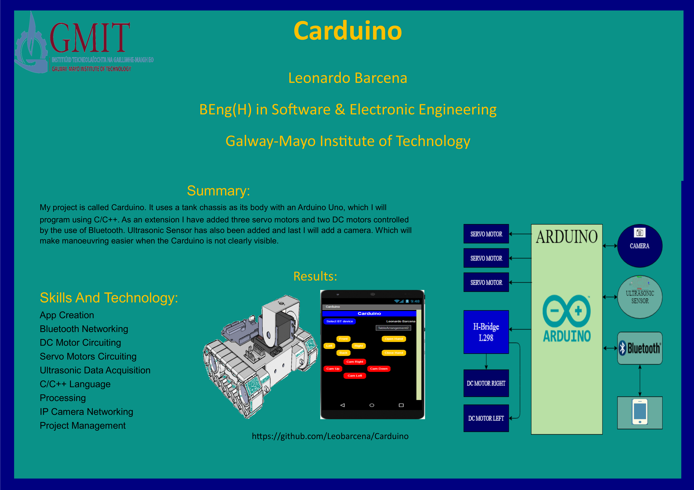

# Carduino – Bluetooth Controlled Robotic Vehicle

  

## 📌 Overview
Carduino is a Bluetooth-controlled robotic vehicle built using Arduino, integrating DC motors, servo motors, and ultrasonic sensing via a custom mobile app.

---

## 🎥 Demo
[▶ Watch Demo Video](https://youtu.be/TE37p_wU4es)

---

## ⚙️ Key Features
- Bluetooth-controlled movement via mobile app  
- DC motor control using H-bridge  
- Servo motor integration for additional movement  
- Ultrasonic sensor for distance detection  
- Real-time system response  

---

## 🛠 Technologies Used
- Arduino (C/C++)  
- Bluetooth communication  
- DC motors & servo motors  
- Ultrasonic sensor  
- Mobile app development  
